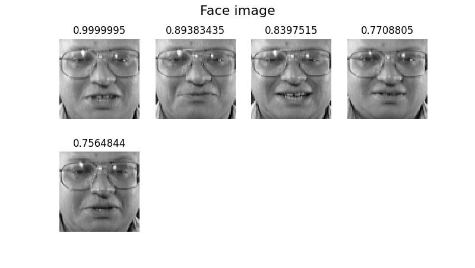
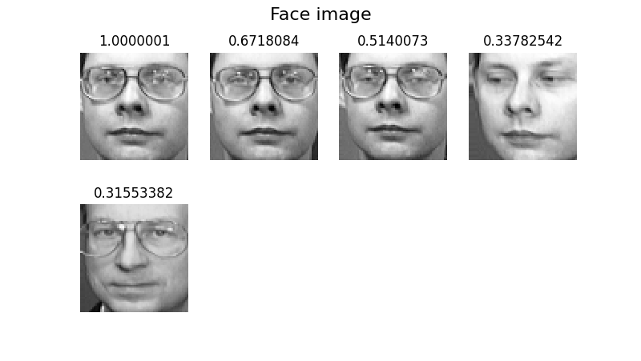
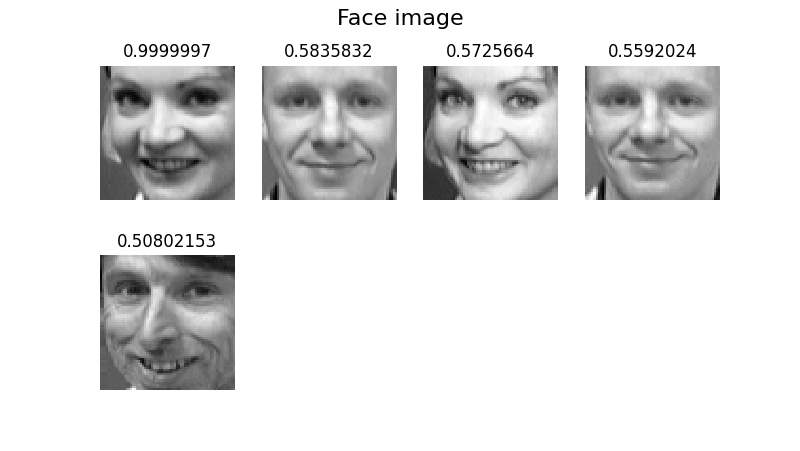
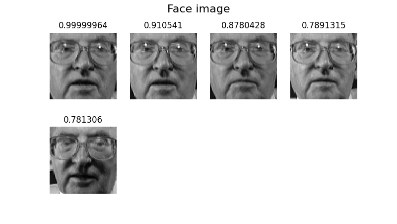
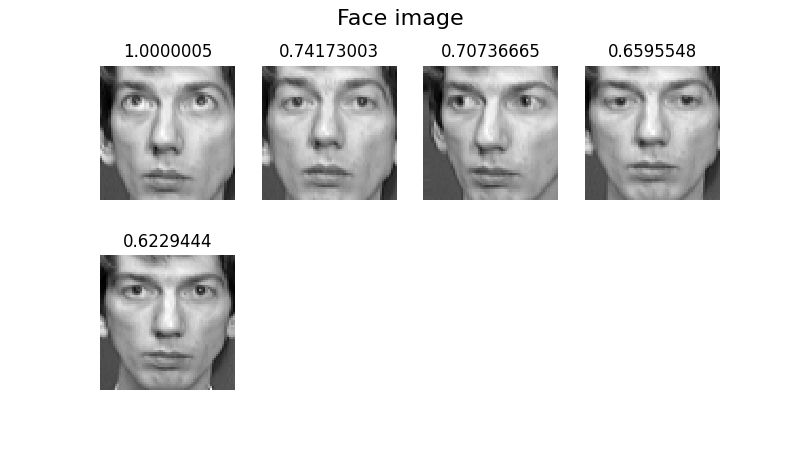
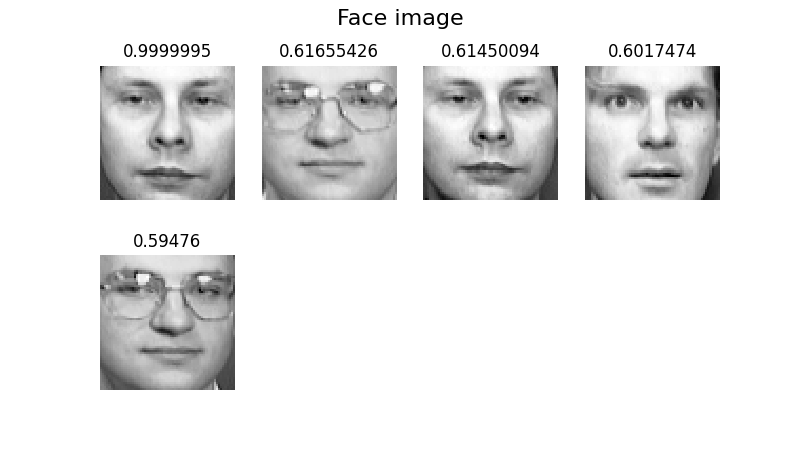
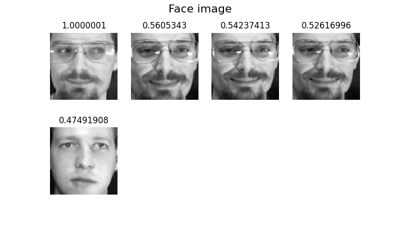
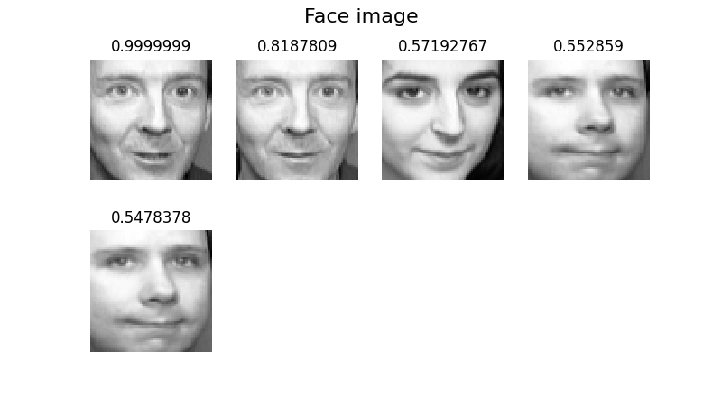
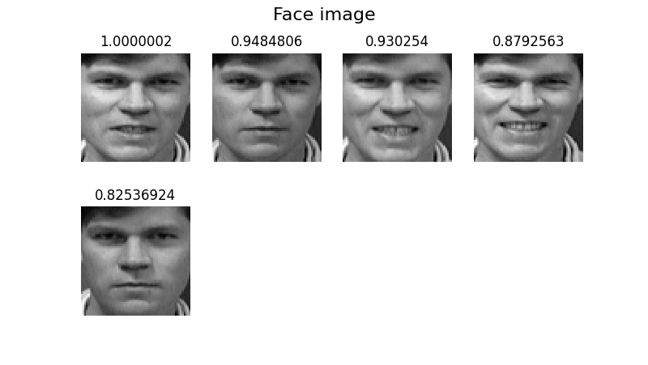
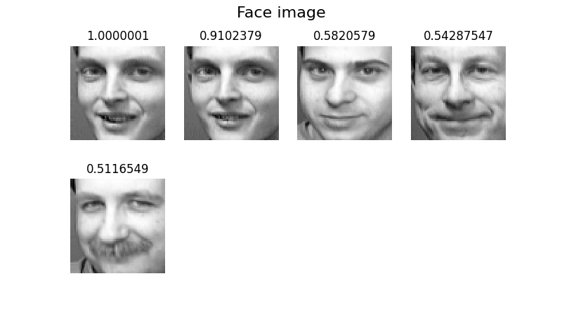

## 矩陣分解的用途
建立日期04/22/2021
### 複雜模型
### PCA降維應用於人臉辨識(Principal Component Analysis)
實作例子，由sklearn Olivetti人臉資料集400張人臉做辨識，識別出相似度高的人臉

1. 
    將影像做decomposite, 將原影像64x64的矩陣，PCA降維成400個特徵的向量
    降維其中一張人臉圖片：
```
from sklearn.decomposition import PCA
def decompositeFace(number):
    face = faces[number]
    pca = PCA()
    pca.fit(faces)
    trans = pca.transform(face.reshape(1, -1))
    return face, pca, trans
```
face為原始資料，為64x64=4096個數值的list，如下：
```
[0.76859504 0.75619835 0.74380165 ... 0.48347107 0.6280992  0.6528926 ]
```
trans為降維結果，為400個特徵數值的list，如下:
```
[[ 3.86336112e+00 -1.33457124e+00 -5.42396688e+00 -1.55312300e+00
-3.08238316e+00  8.36515725e-02 -3.70834738e-01 -4.07046020e-01
...
-1.35044903e-02 -8.21807608e-03 -1.05762482e-02 -1.04055945e-02
4.77945246e-03  6.49258494e-04  6.52116304e-03  9.89111140e-06]]
```
2. 
    利用計算距離的方法計算相似度，取出相似度分數前幾名的資料，繪圖出來比對是否為同一人
```
def calSimilarity(users, rating_matrix):
    cos_sims = cosine_similarity(rating_matrix)
    sims_df = pd.DataFrame(cos_sims, columns = users, index = users)
    sortedIdxSims = []
    for user in cos_sims:
        tmpList = sorted(range(len(user)), key=lambda k: user[k], reverse=True)
        sortedIdxSims.append(tmpList)
    return cos_sims, sortedIdxSims
```
sortedIdxSims為相似度由大到小排列的index

3.
    隨機取出幾張圖片的前五名相似度最高分，結果如下圖，圖片上的數字即為相似度，包含自己的圖片
    <table>
        <tr>
            <td>
                
            </td>
            <td>
                
            </td>
        </tr>
        <tr>
            <td>
                
            </td>
            <td>
                
            </td>
        </tr>
        <tr>
            <td>
                
            </td>
            <td>
                
            </td>
        </tr>
        <tr>
            <td>
                
            </td>
            <td>
                
            </td>
        </tr>
        <tr>
            <td>
                
            </td>
            <td>
                
            </td>
        </tr>
    </table>